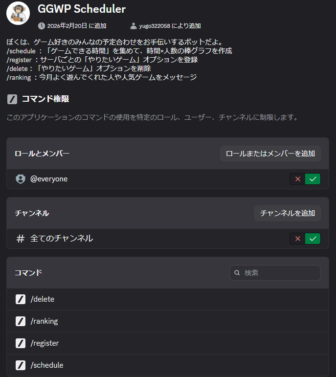
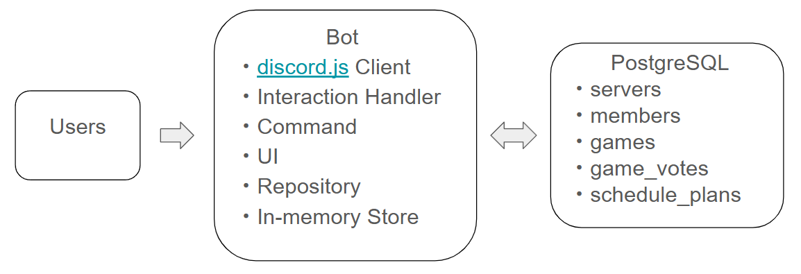

# GGWP Scheduler Bot
- Discord 上でゲームの予定調整を行うためのスケジュール管理 Bot です。  
参加可能時間の可視化、ゲーム投票、ランキング集計、データ永続化までを一貫して実装しました。
[](overview.png)

---

## 1. 概要
### 1.1 開発背景
友人同士でゲームをするとき、Discord 上の「いつ空いてる？」というやり取りが毎回長くなり、  
日程決めに時間がかかることが課題でした。特に、人数が増えるほどテキストだけでは  
「誰が何時に参加できるのか」「どのゲームをやりたい人が多いのか」が把握しづらく、  
主催者の負担が大きい点に着目しました。
この課題を解決するため、Discord 内で完結し、誰でも直感的に使えるスケジュール調整 Bot を開発しました。  
参加可能時間を入力すると人数グラフで可視化し、ゲーム投票や通知、ランキング機能まで一体化することで、  
「調整にかかるコミュニケーションコストを下げる」ことを目標にしています。
### 1.2 主な機能:
- `/schedule`  
  予定調整スレッドを作成し、参加者が複数時間帯を選択可能
- 時間帯ごとの参加人数を棒グラフで可視化
- ゲーム投票（複数選択）とゲーム別票数グラフ表示
- しきい値通知（例: 4人集まったら通知）
- `/register` / `/delete`  
  サーバごとのゲーム候補を DB に追加・削除
- `/ranking`  
  今月のトップユーザ・人気ゲームを表示
- 1か月経過した古い投票データを毎日自動クリーンアップ
---

## 2. 技術スタック
- Language: TypeScript
- Runtime: Node.js
- Bot Framework: discord.js v14
- Database: PostgreSQL (ローカル / Supabase)
- Environment: dotenv
- Development: ts-node-dev
 
---

## 3. アーキテクチャ
[](architecture.png)
- `src/index.ts`  
  Discord イベントハンドリング、コマンド分岐、アプリ全体の制御
- `src/commands/*`  
  Slash command の定義（`schedule`, `register`, `delete`, `ranking`）
- `src/lib/ui.ts`  
  Embed・セレクトメニュー・グラフ描画
- `src/lib/gameRepo.ts`  
  PostgreSQL への問い合わせロジック
- `src/lib/store.ts`  
  実行中メモリ上のスケジュール状態管理
  
---

## 4. 主な機能詳細
### 4.1 スケジュール調整 (`/schedule`)
- スケジュール作成時に時間帯を指定
- 参加者は複数時間帯を選択可能
- 時間帯ごとの参加人数をテキスト棒グラフ化
- 締切後は入力を無効化
### 4.2 通知しきい値
- 通知人数 (1〜20) を選択可能
- 各時間帯でしきい値到達時に通知
- 同一時間帯の重複通知は防止
### 4.3 ゲーム投票
- サーバごとに登録されたゲームを候補として表示
- 複数投票可
- ゲーム別票数を棒グラフ表示
- 最多票ゲームの強調表示
### 4.4 ランキング
- 今月の投票データを集計
- DB 全体ベースで上位ユーザ・上位ゲームを算出可能
### 4.5 データクリーンアップ
- 毎日1回、1か月より古いデータを削除
- 削除時にカウンタ値（games / members）も整合するよう減算
  
---

## 5. DB設計
- `servers`  
  サーバ情報（`discord_guild_id`, `name`）
- `members`  
  サーバ内メンバー情報（`planned_vote_count` など）
- `games`  
  サーバごとのゲーム候補（`total_vote_count`）
- `game_votes`  
  ゲーム投票ログ（重複防止の UNIQUE 制約あり）
- `schedule_plans`  
  予定入力ログ（同一募集の重複カウント防止）

---

## 6. 工夫した点
1. **重複カウント防止**
   - `game_votes` / `schedule_plans` の UNIQUE 制約を活用し、
     同一ユーザの再入力による二重加算を防止
2. **動的UX**
   - テキストベースのグラフを採用したことで Discord 上でリアルタイムに状況把握可能

---

## 7. 今後の展望
- 現在は私が所属しているDiscordサーバーで使用してもらっており、使用感や要望などのフィードバックをもらうようにしている。
- フィードバックをもとにより使いやすいボットになるように改良を進めている。

## 8. セットアップ
### 8.1 必要環境
- Node.js 18+
- PostgreSQL
### 8.2 インストール
```bash
npm install
